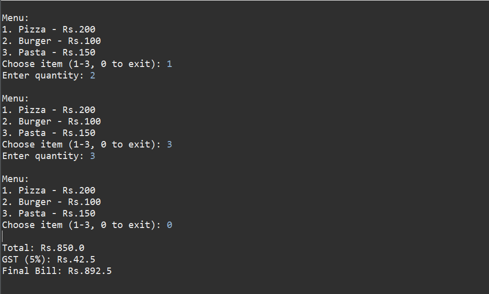

# Online Food Order Bill Generator

## Problem Statement

Develop a Java-based application to simulate a food ordering system and generate a final bill based on user selection.

## Features

* Display menu with items and prices
* Allow multiple item selection
* Accept quantity for each item
* Calculate total bill
* Add GST (5%)
* Display final formatted bill

---

## Technologies Used

* Java
* OOP Concepts
* Arrays
* Loops & Conditional Statements
* Scanner for user input

---

##  How to Run

1. Open Eclipse IDE
2. Create a Java Project
3. Add `FoodOrder.java`
4. Run as **Java Application**

---

## Output Screenshots

